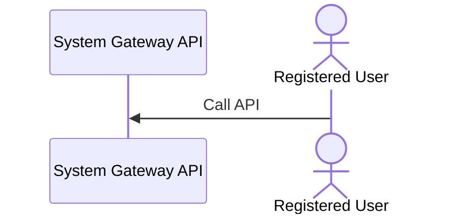
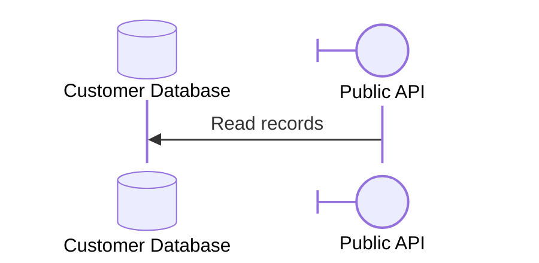

```mermaid
sequenceDiagram
    participant A as System Gateway API
    actor U as Registered User
    U->>A: Call API
```

```mermaid
sequenceDiagram
    participant DB@{ "type": "database", "alias": "Customer Database" }
    participant API@{ "type": "boundary" } as Public API
    API->>DB: Read records
```
