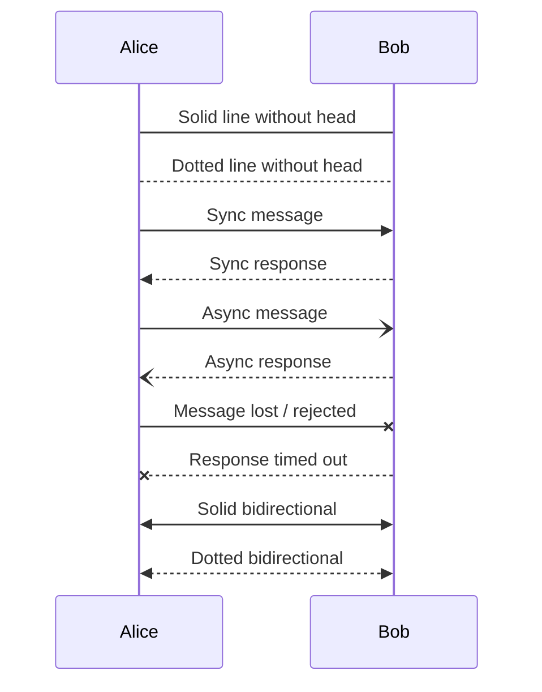

```mermaid
sequenceDiagram
    Alice->Bob: Solid line without head
    Alice-->Bob: Dotted line without head
    Alice->>Bob: Sync message
    Bob-->>Alice: Sync response
    Alice-)Bob: Async message
    Bob--)Alice: Async response
    Alice-xBob: Message lost / rejected
    Bob--xAlice: Response timed out
    Alice<<->>Bob: Solid bidirectional
    Alice<<-->>Bob: Dotted bidirectional
```
