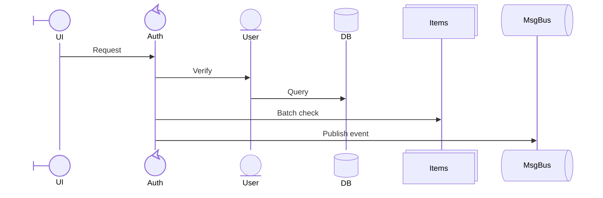

```mermaid
sequenceDiagram
    participant UI@{ "type": "boundary" }
    participant Auth@{ "type": "control" }
    participant User@{ "type": "entity" }
    participant DB@{ "type": "database" }
    participant Items@{ "type": "collections" }
    participant MsgBus@{ "type": "queue" }

    UI->>Auth: Request
    Auth->>User: Verify
    User->>DB: Query
    Auth->>Items: Batch check
    Auth->>MsgBus: Publish event
```
